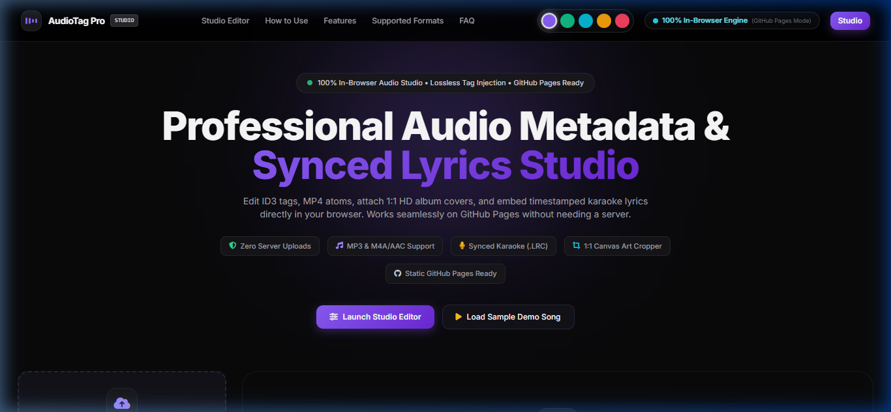
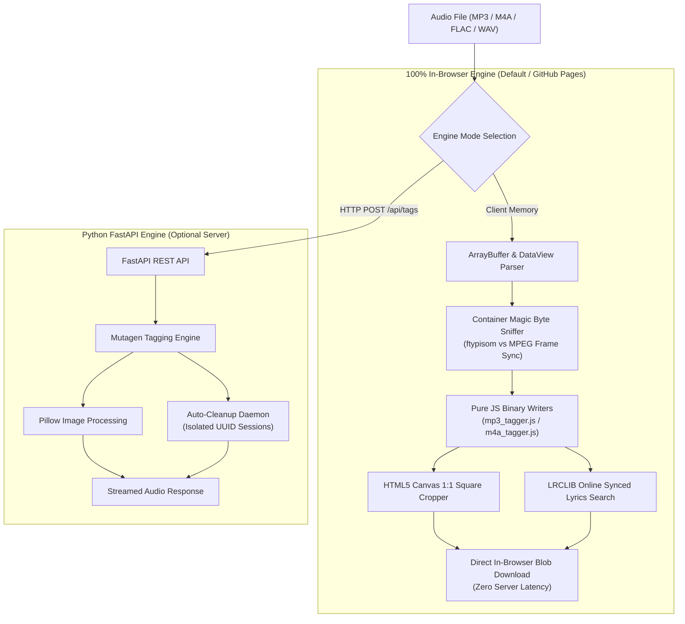

<div align="center">

# 🎵 AudioTag Pro – Audio & Metadata Studio

<p align="center">
  <strong>Next-Gen In-Browser & Python Audio Metadata Editor with Synced Karaoke Lyrics & 1:1 HD Album Art</strong><br />
  <em>Zero-Upload Client Memory Engine • Synced .LRC Embedder • Lossless Container Injection • Dual-Engine Architecture</em>
</p>

<p align="center">
  <a href="https://github.com/dusmamud/music-metadata-editor/actions/workflows/deploy.yml">
    
  </a>
  
  <a href="LICENSE">
    
  </a>
  
  
  
</p>

<p align="center">
  <a href="https://dusmamud.github.io/music-metadata-editor/">
    
  </a>
</p>

<p align="center">
  <a href="#-web-app-preview"><strong>Web App Preview</strong></a> •
  <a href="#-key-features"><strong>Key Features</strong></a> •
  <a href="#-how-it-works"><strong>How It Works</strong></a> •
  <a href="#-supported-formats--standards"><strong>Supported Formats</strong></a> •
  <a href="#-architecture"><strong>Architecture</strong></a> •
  <a href="#-deploy-to-github-pages"><strong>GitHub Pages Deploy</strong></a> •
  <a href="#-local-python-backend"><strong>Python Backend</strong></a> •
  <a href="#-docker-deployment"><strong>Docker</strong></a>
</p>

---

<p align="center">
  <a href="https://dusmamud.github.io/music-metadata-editor/">
    
  </a>
</p>

</div>

## 🌟 Web App Preview

**AudioTag Pro** is a modern audio metadata editor and synced karaoke lyrics studio. It features a **Dual-Engine Architecture**:
1. ⚡ **100% In-Browser Engine (Default / GitHub Pages)**: Runs completely in client memory using Web Audio API, ArrayBuffer, HTML5 Canvas, and pure JS binary taggers. **Zero files are uploaded to any server.**
2. 🐍 **Python FastAPI Backend Engine**: Full-featured server deployment with Mutagen, isolated UUID workspaces, session cleanup daemon, and REST API.

👉 **Launch the live web application immediately:** [**https://dusmamud.github.io/music-metadata-editor/**](https://dusmamud.github.io/music-metadata-editor/)

---

## ✨ Key Features

| Feature | Description |
|---|---|
| 🔒 **Zero Server Uploads (Privacy First)** | Process entire audio files locally in your browser memory with zero network latency. Your audio and artwork never leave your device. |
| 🎤 **Synced Karaoke Lyrics (.LRC)** | Embed timestamped `[mm:ss.xx]` lyrics into standard ID3 `SYLT`/`USLT` and MP4 `©lyr` atoms with real-time auto-scrolling visualizer and LRCLIB search integration. |
| 🖼️ **1:1 HD Album Artwork Studio** | Automatic HTML5 Canvas center-crop pipeline for any image aspect ratio to an exact 1:1 HD square (up to 1200x1200px). |
| ⚡ **Lossless Binary Tag Injection** | Only metadata containers and atom tables are modified. Audio bitstreams (MP3/AAC/FLAC) are **never re-encoded or compressed**. |
| 🔍 **Smart Binary Sniffing** | Direct inspection of container magic bytes (e.g. `ftypisom` vs MPEG sync), preventing corruption when YouTube or Telegram downloads with `.mp3` extension are actually MP4/AAC streams. |
| 🎨 **5 Sleek Theme Palettes** | Switch dynamically between **Neon Violet**, **Cyber Emerald**, **Electric Cyan**, **Sunset Amber**, and **Crimson Rose**. |
| 📱 **Universal Player Compatibility** | Native support across Poweramp, Apple Music, Samsung Music, VLC, Musixmatch, Windows Media Player, and car infotainment systems. |

---

## 🔄 How It Works

```text
┌────────────────────────┐      ┌────────────────────────┐      ┌────────────────────────┐      ┌────────────────────────┐
│  01. Drop Audio Files  │ ──►  │ 02. Auto-Inspect Tags  │ ──►  │ 03. 1:1 Art & LRC Sync │ ──►  │  04. Lossless Export   │
│ Drag & drop MP3/M4A/   │      │ Magic-byte sniffing    │      │ Crop cover art to 1:1  │      │ Lossless binary tag    │
│ FLAC/WAV into memory   │      │ extracts container tags│      │ square & embed lyrics  │      │ injection & download   │
└────────────────────────┘      └────────────────────────┘      └────────────────────────┘      └────────────────────────┘
```

1. **Drop Audio Files**: Select or drag MP3, M4A, FLAC, or WAV tracks. Files are read directly in your browser memory via `ArrayBuffer`.
2. **Auto-Inspect Tags**: Universal byte sniffing extracts container headers, existing ID3/MP4 metadata, and detects mismatched formats.
3. **1:1 Art & Synced LRC**: Drop any cover art image to auto-crop to 1:1 HD square. Search or paste timestamped synced lyrics with real-time scrolling karaoke.
4. **Lossless Export**: Tags are injected into binary containers losslessly without re-encoding audio bitstreams.

---

## 📊 Supported Formats & Standards

| Format | Container | Tagging Standard | Artwork (1:1 HD) | Synced Lyrics (.LRC) | Mobile & Player Support |
|---|---|---|---|---|---|
| **MP3 (`.mp3`)** | MPEG-1/2 Audio Layer III | ID3v2.3 / ID3v2.4 & ID3v1 | ✅ `APIC` Frame | ✅ `SYLT` & `USLT` | Poweramp, Samsung, Apple, VLC, Car Audio |
| **M4A / AAC (`.m4a`)** | ISO Base Media File / MP4 | Apple QuickTime Atoms (`ilst`) | ✅ `covr` Atom | ✅ `©lyr` Atom | Apple Music, Poweramp, Car Audio |
| **FLAC (`.flac`)** | Free Lossless Audio Codec | Vorbis Comments & Metadata Blocks | ✅ `PICTURE` Block | ✅ `LYRICS` Tag | VLC, Poweramp, Hi-Fi DACs |
| **WAV (`.wav`)** | Resource Interchange File (RIFF) | RIFF INFO Chunks & ID3 Chunks | ➖ External ID3 | ✅ Embedded ID3 | DAWs, VLC, QuickTime |

> [!TIP]
> **Smart Binary Sniffing**: Many songs downloaded from YouTube or Telegram have a `.mp3` extension but are actually AAC streams wrapped inside an ISO MP4 container. AudioTag Pro inspects the first 8 bytes (`magic bytes`) to correctly identify the container without corrupting the file.

---

## 🏗️ Architecture



---

## 🌐 Deploy to GitHub Pages (Static Hosting, Zero Python)

This repository is ready for **GitHub Pages** out-of-the-box with **zero server dependencies**:

1. Clone the repository:
   ```bash
   git clone https://github.com/dusmamud/music-metadata-editor.git
   cd music-metadata-editor
   ```
2. Enable GitHub Pages in your repository:
   - Go to **Settings** $\to$ **Pages**.
   - Under **Build and deployment** $\to$ **Source**, choose **GitHub Actions**.
   - The automated `.github/workflows/deploy.yml` workflow will build and publish your site!
3. Your web app is live at:
   ```text
   https://<your-username>.github.io/music-metadata-editor/
   ```

---

## 🐍 Local Python Backend (FastAPI)

If you prefer running with the high-performance Python FastAPI backend:

### Quick Run (Windows)
Double-click `start.bat`.

### Manual Command Line
```bash
# 1. Install dependencies
pip install -r requirements.txt

# 2. Start the FastAPI server
python app.py
```

Open **`http://localhost:8000`** in your browser. The UI will automatically detect the Python backend via `/api/health`.

---

## 🐳 Docker Deployment

Run AudioTag Pro inside an isolated container with Docker:

```bash
docker-compose up -d --build
```

The server will be available on `http://localhost:8000`.

---

## 📁 Repository Structure

```text
music-metadata-editor/
├── index.html                  # Root static entrypoint for GitHub Pages
├── .nojekyll                   # Bypasses Jekyll processing on GitHub Pages
├── .github/
│   └── workflows/deploy.yml    # Automatic GitHub Pages deployment workflow
├── assets/                     # UI previews and documentation media
│   ├── app-preview.png         # High-resolution web app screenshot
│   └── app-preview-full.png    # Full landing page capture
├── app.py                      # FastAPI server entrypoint
├── core/
│   ├── config.py               # Environment configuration & session TTL
│   ├── security.py             # Filename validation & sanitization
│   └── cleanup.py              # Background session auto-cleanup daemon
├── models/
│   └── metadata.py             # Pydantic schemas for audio metadata
├── routes/
│   ├── audio.py                # Audio upload & download endpoints
│   ├── tags.py                 # Metadata extraction & embedding endpoints
│   ├── lyrics.py               # LRCLIB online lyrics search endpoint
│   └── health.py               # Health check endpoint
├── services/
│   ├── session_manager.py      # Session file management
│   ├── tagger_engine.py        # Mutagen audio engine
│   ├── cover_processor.py      # Pillow cover art square cropper
│   └── lyrics_service.py       # Synced lyrics fetching & verification
├── static/
│   ├── css/studio.css          # Glassmorphic stylesheet with 5 themes & zero-overflow
│   ├── favicon.svg             # Vector soundwave studio icon
│   └── js/
│       ├── tagger/
│       │   ├── mp3_tagger.js   # Pure JS ID3v2/v1 parser & binary writer
│       │   ├── m4a_tagger.js   # Pure JS MP4 atom parser & binary writer
│       │   └── universal_tagger.js # Magic-byte sniffer & canvas 1:1 cropper
│       ├── player.js           # Audio player & real-time karaoke scroller
│       ├── uploader.js         # Client-side ArrayBuffer drag & drop handler
│       ├── api.js              # Dual-engine API client
│       └── app.js              # Master UI controller with theme switcher
├── templates/
│   └── index.html              # FastAPI Jinja2 template mirror
├── tests/
│   ├── test_browser_taggers.js # JavaScript test suite
│   └── test_engine.py          # Python backend test suite
├── Dockerfile                  # Container definition
├── docker-compose.yml          # Multi-container orchestration
├── requirements.txt            # Python dependencies (FastAPI, Mutagen, Pillow)
├── start.bat                   # 1-click Windows launcher
└── LICENSE                     # MIT License
```

---

## 📄 License

Distributed under the **MIT License**. Free for personal, open-source, and commercial use. See [`LICENSE`](LICENSE) for details.

---

<div align="center">

**Developed with ❤️ by [Dus Mamud](https://github.com/dusmamud)**

If you found this tool useful, give it a ⭐️ on [GitHub](https://github.com/dusmamud/music-metadata-editor)!

</div>
